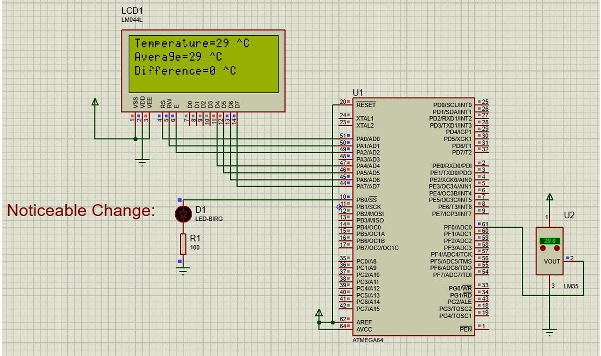
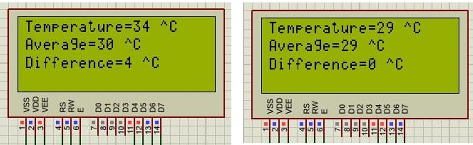
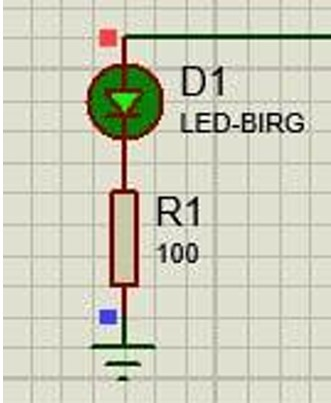

# 🌡️ AVR-Based Temperature Alert System

This is an embedded systems project designed using the **ATMega64** microcontroller and **LM35** temperature sensor. The system monitors real-time temperature, calculates an average, and raises an alert if the temperature change exceeds a threshold.

---

## 🛠️ System Overview

- **Microcontroller:** ATMega64
- **Sensor:** LM35 (Analog Temperature Sensor)
- **Display:** 16x2 Character LCD
- **Alert:** LED turns ON if temperature change > 3°C in 10 seconds
- **Software:** CodeVisionAVR for coding, Proteus for simulation

---

## 🎯 Project Description

The program reads temperature via ADC from the LM35 sensor, displays the current and average temperature on an LCD, and triggers a visual alert (LED) if the temperature varies by more than 3°C within a 10-second window.

---

## 📸 Demonstration Images

### 🧩 Simulation Overview (Proteus)



### 📟 LCD: Neutral vs Alert State



### 🔴 LED Triggered on Temperature Alert



---

## 🎥 Video Demonstration

Watch the full demo video showing real-time operation of the project, with explanation of the logic and code. *(in Persian)*

📺 [YouTube Demo Video](https://youtu.be/1NY2_btq1LM)

---

## 📁 Repository Structure

```
AVR-Temperature-Alert-System/
├── src/                      # C source code for ATMega64
├── images/                   # All images used in README
├── simulation/               # Proteus files (if applicable)
├── video/                    # Link or reference to video demo
└── README.md
```

---


## 👨‍💻 Author

**Aliakbar Mohsennejad**  
Electrical Engineering – Digital Systems  
K. N. Toosi University of Technology

---

## 🏷️ Tags

`avr` `atmega64` `lm35` `temperature-sensor` `embedded-systems` `microcontroller` `codevision` `proteus` `lcd` `adc` `kntu`
